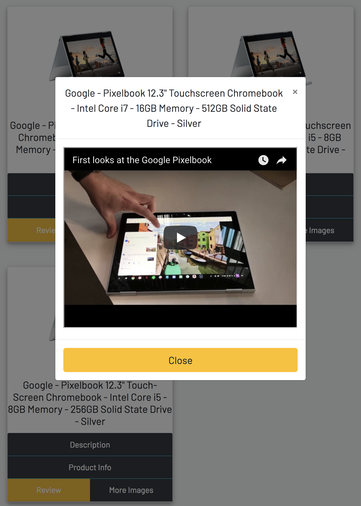

<h1>ProductCheck</h1>

<h4>
This App will allow you to search "electronics" [Laptops, Phones, Tablest] from BestBuy's, YouTube, Google Custom Search API and show you detailed information.
</h4>

<h4> GitHub Repo: https://github.com/HanBitPix/ComparePrice </h4>
<h4> Live Demo: https://hanbitpix.github.io/ProductCheck/ </h4>

<h3>APIs</h3>
<h4>BestBuy API</h4>
<h4>YouTube API</h4>
<h4>Google Custom Search API</h4>

<h2> Step by step Guide with Screenshot </h2>

<h3>Step 1</h3>
<h4>Search by brand or product name</h4>

<h3>Step 2</h3>
<h4>Here we have detailed product results for Pixel Products form the BestBuy API Data</h4>

<h3>Step 3</h3>
<h4>If you click on "Description" text, a drop down with the product descritpion will show</h4>

<h3>Step 4</h3>
<h4>Next if you click on  "Product Info" text, a drop down with the product details will show</h4>

<h3>Step 5</h3>
<h4>Next if you click on "Review" text, a modal pop-up of the product video review will show from YouTube API</h4>

<h3>Step 6</h3>
<h4>Next if you click on "More Images" text, a modal pop-up with more of the product images will show from Google Custom Search API</h4>

<h2> Built With </h2>
<h4> Front-End </h4>
<ul>
  <li>HTML</li>
  <li>CSS</li>
   <ul> 
    <li>Bootstrap</li>
   </ul>
  <li>JS</li>
  <ul>
    <li>jQuery</li>
  </ul>
 </ul>
 
<h2> Developer </h2>
<h4> Jacob Han </h4>
